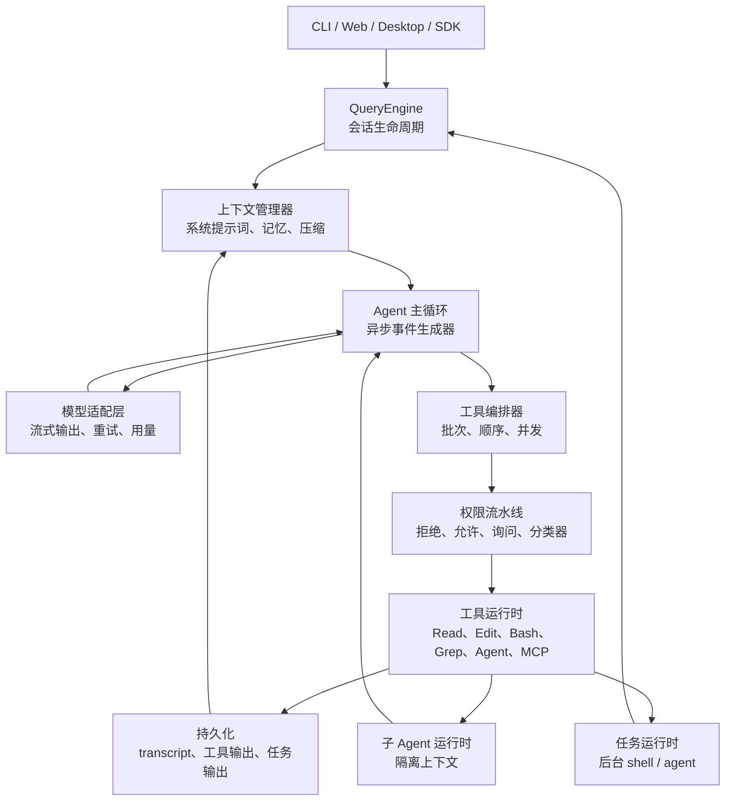

# 先读这里

## 本章目标

让读者快速理解项目目标、关键数字、实施顺序和第一版交付物。

完成本章后，读者应该知道这一层为什么存在、如何实现最小版本、哪些默认值不能随意改、以及如何验收。

如果你的目标是实现框架，请先读 [详细设计索引](./detailed-design/00-index.md)。00-30 章节负责学习路线和总览；真正细到状态机、阈值、接口、伪代码、提示词模板、失败分支和验收用例的内容，放在 `docs/detailed-design/`。

## 核心概念

- 文档入口必须降低上手成本。
- 本章能力必须有清晰的输入、输出、失败语义和测试边界。
- 任何影响模型下一步行为的状态，都必须能被记录、恢复或回放。

## 架构位置

本章位于 `onboarding` 层。它不是孤立模块，而是和主循环、工具系统、上下文管理、持久化、权限或 SDK 事件流共同工作。实现时要明确本层是否拥有状态，是否会产生副作用，是否会改变下一轮模型输入。

## 具体设计

最小设计应包含四个部分：输入对象、输出对象、错误对象和持久化记录。输入对象用于阻止隐式全局依赖；输出对象用于让 UI、SDK 和 replay 共用同一结果；错误对象用于让模型或用户知道下一步怎么恢复；持久化记录用于崩溃后继续运行。

成熟设计还应该补充可观测性和预算控制。只要本章能力可能变慢、变贵、失败或产生副作用，就必须发出事件并记录关键 ID。

## 接口与数据结构

| 边界 | 说明 |
|---|---|
| 输入 | 调用方必须显式传入的状态和参数。 |
| 输出 | 成功时返回的数据、事件或状态变更。 |
| 错误 | 失败时返回给用户、模型或调用方的结构化错误。 |
| 持久化 | 必须写入 transcript、metadata 或输出文件的内容。 |
| 回放 | 回放测试需要记录和模拟的输入输出。 |

建议接口命名保持直接，例如 `onboardingConfig`、`onboardingState`、`onboardingEvent`、`onboardingResult`。如果这些类型变得过大，优先拆分所有权，而不是把所有字段塞进一个全局对象。

## 默认值与关键数字

| 参数名 | 中文含义 | 单位 | 默认值 | 为什么是这个值 | 触发行为 | 调大后果 | 调小后果 |
|---|---|---|---:|---|---|---|---|
| `configSource` | 配置文件入口 | 路径 | `.agent/config.json` | 框架需要一个固定入口来读取项目级默认值，避免每个模块自己猜配置位置。 | 启动或加载项目时读取；缺失时使用内置默认值并提示初始化。 | 多配置入口会增加排查成本。 | 过少会导致项目级覆盖能力不足。 |
| `owner` | 模块所有权标记 | 文本 | `explicit module` | 要求实现者明确哪个模块拥有状态，防止多个模块同时修改同一份状态。 | 设计或实现模块边界时使用。 | 所有权过细会增加跨模块协调。 | 所有权过粗会形成全局对象。 |
| `testMode` | 测试模式要求 | 文本 | `replay case required` | 要求该模块至少能被 replay case 覆盖，避免只靠人工验证。 | 写测试和回放 fixture 时使用。 | 测试要求过高会拖慢原型。 | 测试要求过低会让重构风险变大。 |

如果本章没有专属数字，就使用 `.agent/config.json` 中的全局默认值；新增参数时也必须补齐“含义、单位、默认值原因、触发行为、调大后果、调小后果”。

## 实现步骤

1. 先实现最小闭环，再添加高级能力。
2. 定义输入、输出、错误和持久化边界。
3. 把默认值集中到配置或常量模块。
4. 为正常路径、失败路径和边界值写测试。
5. 把影响下一轮模型行为的状态写入 transcript、metadata 或 replay fixture。

## 测试与验收

- 正常路径必须产出符合接口的结果。
- 失败路径必须返回结构化错误，而不是静默失败。
- 达到默认限制时必须触发文档规定的行为。
- 恢复或回放时结果必须可解释。
- 相关验收标准必须能被自动化测试验证。

## 常见错误

- 只写概念，没有写输入输出和验收。
- 把默认数字散落在多个实现文件。
- 失败时直接 throw，导致主循环无法恢复。
- 没有 replay case，后续重构容易破坏行为。

## 本章总结

本章的重点是把 `onboarding` 层变成可实现、可测试、可恢复的工程边界。只要边界清楚，后续实现者就不需要靠猜。

## 参考蓝图细节

以下内容保留原始架构蓝图中的细节、表格和代码片段，供实现时逐项对照。

本文档是一份可复用的智能体系统架构规格书。目标不是解释“智能体是什么”，而是给出可以直接照着实现的模块、接口、状态机、阈值、默认配置、失败处理和测试验收标准。

本版对原文档做了 10 轮优化，每一轮对应一个具体交付物：

| 1 | 结构审计 | 明确主路径：入口 -> 会话 -> Agent Loop -> 模型 -> 工具 -> 结果 -> 持久化 |
| 2 | 数字复核 | 增加全局常量表，并区分源码硬默认、可配置默认、推荐默认 |
| 3 | 模块图 | 增加端到端架构图和源码映射表 |
| 4 | 主循环 | 增加状态机、失败路径、必须保持的 transcript invariant |
| 5 | 上下文 | 补充预算公式、200k/1M 两组计算样例、触发顺序 |
| 6 | 工具系统 | 补充工具生命周期、并发边界、结果落盘规则 |
| 7 | 单 Agent MVP | 拆成 4 个开发阶段，每阶段有验收标准 |
| 8 | 多 Agent | 补充子 Agent 隔离、通信、后台任务、权限冒泡 |
| 9 | 生产化 | 补充测试矩阵、观测事件、恢复策略 |
| 10 | 文档收敛 | 统一术语、去掉泛泛建议，把模糊处改成实现约束 |

读完前 10 轮版本后，继续做第 11-20 轮优化。原因：前 10 轮已经覆盖核心 runtime，但一个真正可复用的 Agent 框架还需要 provider 抽象、prompt 组装、配置、存储 schema、SDK/UI 协议、评估回放、安全沙箱、预算控制、多 Agent 合并和部署形态。

| 11 | 工程缺口审计 | 明确还缺模型适配、prompt pipeline、配置、存储、SDK、评估、安全、预算、冲突处理、部署 |
| 12 | 模型适配层 | 增加 ProviderAdapter 接口、重试/退避/stream watchdog 具体数字 |
| 13 | Prompt 组装 | 增加固定上下文顺序、预算分区、工具 schema 注入规则 |
| 14 | 配置系统 | 增加配置优先级、目录结构、环境变量覆盖 |
| 15 | 存储 schema | 增加 transcript、tool output、task、agent metadata 的文件格式 |
| 16 | SDK/UI 协议 | 增加事件流协议、控制消息、前端渲染边界 |
| 17 | 测试评估 | 增加 golden replay、模拟模型、工具 fixture、回归指标 |
| 18 | 安全边界 | 增加 sandbox、路径策略、秘密处理、审计日志 |
| 19 | 成本预算 | 增加 token/cost/tool/task/subagent 预算与速率限制 |
| 20 | 多 Agent 收敛 | 增加文件冲突、worktree merge、部署模式和最终缺口清单 |

这份文档主要从下列源码文件抽取架构，不依赖猜测：

下表是实现一个 Agent 框架时可以直接放进配置文件的默认值。

下表中的“默认值”采用架构建议值；如果源码硬默认不同，放在“为什么是这个值”里说明。每一行都写明触发行为和调参后果，避免只看到数字却不知道怎么实现。

| 参数名 | 中文含义 | 单位 | 默认值 | 为什么是这个值 | 触发行为 | 调大后果 | 调小后果 |
|---|---|---|---:|---|---|---|---|
| `context.window.defaultTokens` | 默认上下文窗口 | tokens | `200_000` | 这些上下文数字共同保证 prompt 不会占满窗口，并给输出、压缩和恢复留空间。 | 对应模块执行到该决策点时读取。 | 更宽松，容量或等待时间增加，但成本、延迟或风险上升。 | 更保守，更早截断、压缩、失败或需要用户确认。 |
| `context.window.largeTokens` | 大上下文模型窗口 | tokens | `1_000_000` | 这些上下文数字共同保证 prompt 不会占满窗口，并给输出、压缩和恢复留空间。 | 对应模块执行到该决策点时读取。 | 更宽松，容量或等待时间增加，但成本、延迟或风险上升。 | 更保守，更早截断、压缩、失败或需要用户确认。 |
| `context.compact.summaryReserveTokens` | 压缩摘要/输出预留空间 | tokens | `20_000` | 这些上下文数字共同保证 prompt 不会占满窗口，并给输出、压缩和恢复留空间。 | 计算上下文预算和压缩阈值时使用。 | 更宽松，容量或等待时间增加，但成本、延迟或风险上升。 | 更保守，更早截断、压缩、失败或需要用户确认。 |
| `context.compact.autoBufferTokens` | 自动压缩缓冲 | tokens | `13_000` | 这些上下文数字共同保证 prompt 不会占满窗口，并给输出、压缩和恢复留空间。 | 计算上下文预算和压缩阈值时使用。 | 更宽松，容量或等待时间增加，但成本、延迟或风险上升。 | 更保守，更早截断、压缩、失败或需要用户确认。 |
| `context.compact.warningBufferTokens` | 低上下文警告缓冲 | tokens | `20_000` | 这些上下文数字共同保证 prompt 不会占满窗口，并给输出、压缩和恢复留空间。 | 计算上下文预算和压缩阈值时使用。 | 更宽松，容量或等待时间增加，但成本、延迟或风险上升。 | 更保守，更早截断、压缩、失败或需要用户确认。 |
| `context.compact.errorBufferTokens` | 错误态缓冲 | tokens | `20_000` | 这些上下文数字共同保证 prompt 不会占满窗口，并给输出、压缩和恢复留空间。 | 计算上下文预算和压缩阈值时使用。 | 更宽松，容量或等待时间增加，但成本、延迟或风险上升。 | 更保守，更早截断、压缩、失败或需要用户确认。 |
| `context.compact.manualReserveTokens` | 阻塞前手动压缩余量 | tokens | `3_000` | 这些上下文数字共同保证 prompt 不会占满窗口，并给输出、压缩和恢复留空间。 | 计算上下文预算和压缩阈值时使用。 | 更宽松，容量或等待时间增加，但成本、延迟或风险上升。 | 更保守，更早截断、压缩、失败或需要用户确认。 |
| `context.compact.maxConsecutiveFailures` | 自动压缩失败熔断次数 | 个/次 | `3` | 这些上下文数字共同保证 prompt 不会占满窗口，并给输出、压缩和恢复留空间。 | 请求超过该值时截断、拒绝、排队或要求用户确认。 | 更宽松，容量或等待时间增加，但成本、延迟或风险上升。 | 更保守，更早截断、压缩、失败或需要用户确认。 |
| `model.output.cappedDefaultTokens` | 普通模型输出上限 | tokens | `8_000` | 这个值按 token 预算设置，用来把关键上下文放进模型输入，同时避免某一类内容挤掉最新用户意图。 | 组装 prompt 或计算 token 预算时使用。 | 该类内容可保留更多，但会挤压其它上下文。 | prompt 更紧凑，但可能丢失必要背景。 |
| `model.output.escalatedRetryTokens` | 输出截断恢复上限 | tokens | `64_000` | 这个值按 token 预算设置，用来把关键上下文放进模型输入，同时避免某一类内容挤掉最新用户意图。 | 组装 prompt 或计算 token 预算时使用。 | 该类内容可保留更多，但会挤压其它上下文。 | prompt 更紧凑，但可能丢失必要背景。 |
| `tool.maxConcurrency` | 工具并发上限 | 个/次 | `10` | 源码默认：implementation dependent；该值限制工具输出和并发，防止工具结果污染上下文或拖垮执行器。 | 请求超过该值时截断、拒绝、排队或要求用户确认。 | 更宽松，容量或等待时间增加，但成本、延迟或风险上升。 | 更保守，更早截断、压缩、失败或需要用户确认。 |
| `tool.result.defaultPersistChars` | 工具结果落盘阈值 | 字符 | `50_000` | 该值限制工具输出和并发，防止工具结果污染上下文或拖垮执行器。 | 对应模块执行到该决策点时读取。 | 更宽松，容量或等待时间增加，但成本、延迟或风险上升。 | 更保守，更早截断、压缩、失败或需要用户确认。 |
| `tool.result.perMessageChars` | 单条消息工具结果总预算 | 字符 | `200_000` | 该值限制工具输出和并发，防止工具结果污染上下文或拖垮执行器。 | 对应模块执行到该决策点时读取。 | 更宽松，容量或等待时间增加，但成本、延迟或风险上升。 | 更保守，更早截断、压缩、失败或需要用户确认。 |
| `tool.result.hardBudgetTokens` | 工具结果硬预算 | tokens | `100_000` | 该值限制工具输出和并发，防止工具结果污染上下文或拖垮执行器。 | 对应模块执行到该决策点时读取。 | 更宽松，容量或等待时间增加，但成本、延迟或风险上升。 | 更保守，更早截断、压缩、失败或需要用户确认。 |
| `tool.result.bytesPerToken` | 粗略 token 估算比例 | tokens | `4` | 该值限制工具输出和并发，防止工具结果污染上下文或拖垮执行器。 | 对应模块执行到该决策点时读取。 | 更宽松，容量或等待时间增加，但成本、延迟或风险上升。 | 更保守，更早截断、压缩、失败或需要用户确认。 |
| `tool.result.previewBytes` | 落盘输出预览大小 | 字节 | `2_000` | 该值限制工具输出和并发，防止工具结果污染上下文或拖垮执行器。 | 对应模块执行到该决策点时读取。 | 更宽松，容量或等待时间增加，但成本、延迟或风险上升。 | 更保守，更早截断、压缩、失败或需要用户确认。 |
| `bash.timeout.defaultMs` | Bash 默认超时 | 毫秒 | `120_000` | 该值让常见命令有机会完成，同时避免长命令卡住主循环。 | 运行时间超过该值时触发超时、重试或后台化。 | 更宽松，容量或等待时间增加，但成本、延迟或风险上升。 | 更保守，更早截断、压缩、失败或需要用户确认。 |
| `bash.timeout.maxMs` | Bash 最大超时 | 毫秒 | `600_000` | 该值让常见命令有机会完成，同时避免长命令卡住主循环。 | 请求超过该值时截断、拒绝、排队或要求用户确认。 | 更宽松，容量或等待时间增加，但成本、延迟或风险上升。 | 更保守，更早截断、压缩、失败或需要用户确认。 |
| `bash.progressAfterMs` | Bash 进度提示延迟 | 毫秒 | `2_000` | 该值让常见命令有机会完成，同时避免长命令卡住主循环。 | 运行时间超过该值时触发超时、重试或后台化。 | 更宽松，容量或等待时间增加，但成本、延迟或风险上升。 | 更保守，更早截断、压缩、失败或需要用户确认。 |
| `bash.autoBackgroundAfterMs` | 自动后台任务阈值 | 毫秒 | `15_000` | 该值让常见命令有机会完成，同时避免长命令卡住主循环。 | 运行时间超过该值时触发超时、重试或后台化。 | 更宽松，容量或等待时间增加，但成本、延迟或风险上升。 | 更保守，更早截断、压缩、失败或需要用户确认。 |
| `bash.blockSleepSecondsGte` | 独立 sleep 阻断阈值 | 秒 | `2` | 该值让常见命令有机会完成，同时避免长命令卡住主循环。 | 对应模块执行到该决策点时读取。 | 更宽松，容量或等待时间增加，但成本、延迟或风险上升。 | 更保守，更早截断、压缩、失败或需要用户确认。 |
| `read.output.maxTokens` | Read 输出上限 | tokens | `25_000` | 该值保护工作区读取和编辑过程，避免超大文件、超多结果或误编辑。 | 请求超过该值时截断、拒绝、排队或要求用户确认。 | 更宽松，容量或等待时间增加，但成本、延迟或风险上升。 | 更保守，更早截断、压缩、失败或需要用户确认。 |
| `read.file.maxSizeBytes` | Read 文件大小上限 | 字节 | `256 KB` | 该值保护工作区读取和编辑过程，避免超大文件、超多结果或误编辑。 | 请求超过该值时截断、拒绝、排队或要求用户确认。 | 更宽松，容量或等待时间增加，但成本、延迟或风险上升。 | 更保守，更早截断、压缩、失败或需要用户确认。 |
| `read.cache.entries` | Read 缓存条数 | 个/次 | `100` | 该值保护工作区读取和编辑过程，避免超大文件、超多结果或误编辑。 | 对应模块执行到该决策点时读取。 | 更宽松，容量或等待时间增加，但成本、延迟或风险上升。 | 更保守，更早截断、压缩、失败或需要用户确认。 |
| `read.cache.memoryBytes` | Read 缓存内存上限 | 字节 | `25 MB` | 该值保护工作区读取和编辑过程，避免超大文件、超多结果或误编辑。 | 对应模块执行到该决策点时读取。 | 更宽松，容量或等待时间增加，但成本、延迟或风险上升。 | 更保守，更早截断、压缩、失败或需要用户确认。 |
| `grep.defaultHeadLimit` | Grep 返回条数上限 | 个/次 | `250` | 该值保护工作区读取和编辑过程，避免超大文件、超多结果或误编辑。 | 请求超过该值时截断、拒绝、排队或要求用户确认。 | 更宽松，容量或等待时间增加，但成本、延迟或风险上升。 | 更保守，更早截断、压缩、失败或需要用户确认。 |
| `glob.defaultMaxResults` | Glob 返回路径上限 | 个/次 | `100` | 该值保护工作区读取和编辑过程，避免超大文件、超多结果或误编辑。 | 请求超过该值时截断、拒绝、排队或要求用户确认。 | 更宽松，容量或等待时间增加，但成本、延迟或风险上升。 | 更保守，更早截断、压缩、失败或需要用户确认。 |
| `edit.maxFileSizeBytes` | 可编辑文件大小上限 | 字节 | `1 GiB` | 该值保护工作区读取和编辑过程，避免超大文件、超多结果或误编辑。 | 请求超过该值时截断、拒绝、排队或要求用户确认。 | 更宽松，容量或等待时间增加，但成本、延迟或风险上升。 | 更保守，更早截断、压缩、失败或需要用户确认。 |
| `agent.fork.maxTurns` | fork Agent 最大轮数 | 个/次 | `200` | 该值限制子 Agent 执行规模，避免多 Agent 爆炸式消耗。 | 请求超过该值时截断、拒绝、排队或要求用户确认。 | 更宽松，容量或等待时间增加，但成本、延迟或风险上升。 | 更保守，更早截断、压缩、失败或需要用户确认。 |
| `agent.default.maxTurns` | 普通子 Agent 最大轮数 | 个/次 | `20` | 源码默认：agent definition；该值限制子 Agent 执行规模，避免多 Agent 爆炸式消耗。 | 请求超过该值时截断、拒绝、排队或要求用户确认。 | 更宽松，容量或等待时间增加，但成本、延迟或风险上升。 | 更保守，更早截断、压缩、失败或需要用户确认。 |
| `agent.mcp.waitMaxMs` | MCP 连接等待上限 | 毫秒 | `30_000` | 该值限制子 Agent 执行规模，避免多 Agent 爆炸式消耗。 | 请求超过该值时截断、拒绝、排队或要求用户确认。 | 更宽松，容量或等待时间增加，但成本、延迟或风险上升。 | 更保守，更早截断、压缩、失败或需要用户确认。 |
| `agent.mcp.pollIntervalMs` | MCP ready 轮询间隔 | 毫秒 | `500` | 该值限制子 Agent 执行规模，避免多 Agent 爆炸式消耗。 | 运行时间超过该值时触发超时、重试或后台化。 | 更宽松，容量或等待时间增加，但成本、延迟或风险上升。 | 更保守，更早截断、压缩、失败或需要用户确认。 |
| `agent.progressHintAfterMs` | 子 Agent 进度提示延迟 | 毫秒 | `2_000` | 该值限制子 Agent 执行规模，避免多 Agent 爆炸式消耗。 | 运行时间超过该值时触发超时、重试或后台化。 | 更宽松，容量或等待时间增加，但成本、延迟或风险上升。 | 更保守，更早截断、压缩、失败或需要用户确认。 |
| `agent.uiProgressMessages` | UI 展示进度条数 | 个/次 | `3` | 该值限制子 Agent 执行规模，避免多 Agent 爆炸式消耗。 | 对应模块执行到该决策点时读取。 | 更宽松，容量或等待时间增加，但成本、延迟或风险上升。 | 更保守，更早截断、压缩、失败或需要用户确认。 |
| `web.urlMaxChars` | URL 长度上限 | 字符 | `2_000` | 该值限制外部内容体积，避免网络或媒体输入挤爆上下文。 | 请求超过该值时截断、拒绝、排队或要求用户确认。 | 更宽松，容量或等待时间增加，但成本、延迟或风险上升。 | 更保守，更早截断、压缩、失败或需要用户确认。 |
| `web.httpMaxBytes` | HTTP 内容上限 | 字节 | `10 MB` | 该值限制外部内容体积，避免网络或媒体输入挤爆上下文。 | 请求超过该值时截断、拒绝、排队或要求用户确认。 | 更宽松，容量或等待时间增加，但成本、延迟或风险上升。 | 更保守，更早截断、压缩、失败或需要用户确认。 |
| `web.fetchTimeoutMs` | Fetch 超时 | 毫秒 | `60_000` | 该值限制外部内容体积，避免网络或媒体输入挤爆上下文。 | 运行时间超过该值时触发超时、重试或后台化。 | 更宽松，容量或等待时间增加，但成本、延迟或风险上升。 | 更保守，更早截断、压缩、失败或需要用户确认。 |
| `web.maxRedirects` | 最大重定向次数 | 个/次 | `10` | 该值限制外部内容体积，避免网络或媒体输入挤爆上下文。 | 请求超过该值时截断、拒绝、排队或要求用户确认。 | 更宽松，容量或等待时间增加，但成本、延迟或风险上升。 | 更保守，更早截断、压缩、失败或需要用户确认。 |
| `media.imageMaxBase64Bytes` | 单图 base64 上限 | 字节 | `5 MB` | 该值限制外部内容体积，避免网络或媒体输入挤爆上下文。 | 请求超过该值时截断、拒绝、排队或要求用户确认。 | 更宽松，容量或等待时间增加，但成本、延迟或风险上升。 | 更保守，更早截断、压缩、失败或需要用户确认。 |
| `media.imageMaxWidthPx` | 图片宽度上限 | 像素 | `2_000` | 该值限制外部内容体积，避免网络或媒体输入挤爆上下文。 | 请求超过该值时截断、拒绝、排队或要求用户确认。 | 更宽松，容量或等待时间增加，但成本、延迟或风险上升。 | 更保守，更早截断、压缩、失败或需要用户确认。 |
| `media.imageMaxHeightPx` | 图片高度上限 | 像素 | `2_000` | 该值限制外部内容体积，避免网络或媒体输入挤爆上下文。 | 请求超过该值时截断、拒绝、排队或要求用户确认。 | 更宽松，容量或等待时间增加，但成本、延迟或风险上升。 | 更保守，更早截断、压缩、失败或需要用户确认。 |
| `media.maxItemsPerRequest` | 单请求媒体数量上限 | 个/次 | `100` | 该值限制外部内容体积，避免网络或媒体输入挤爆上下文。 | 请求超过该值时截断、拒绝、排队或要求用户确认。 | 更宽松，容量或等待时间增加，但成本、延迟或风险上升。 | 更保守，更早截断、压缩、失败或需要用户确认。 |
| `api.retry.defaultMaxRetries` | API 默认重试次数 | 个/次 | `10` | 该值在恢复临时 provider 故障和避免无限等待之间取折中。 | 请求超过该值时截断、拒绝、排队或要求用户确认。 | 更宽松，容量或等待时间增加，但成本、延迟或风险上升。 | 更保守，更早截断、压缩、失败或需要用户确认。 |
| `api.retry.baseDelayMs` | 重试退避起点 | 毫秒 | `500` | 该值在恢复临时 provider 故障和避免无限等待之间取折中。 | 运行时间超过该值时触发超时、重试或后台化。 | 更宽松，容量或等待时间增加，但成本、延迟或风险上升。 | 更保守，更早截断、压缩、失败或需要用户确认。 |
| `api.retry.maxDelayMs` | 普通退避上限 | 毫秒 | `32_000` | 该值在恢复临时 provider 故障和避免无限等待之间取折中。 | 请求超过该值时截断、拒绝、排队或要求用户确认。 | 更宽松，容量或等待时间增加，但成本、延迟或风险上升。 | 更保守，更早截断、压缩、失败或需要用户确认。 |
| `api.retry.jitterRatio` | 退避随机抖动比例 | 比例 | `0.25` | 该值在恢复临时 provider 故障和避免无限等待之间取折中。 | 对应模块执行到该决策点时读取。 | 更宽松，容量或等待时间增加，但成本、延迟或风险上升。 | 更保守，更早截断、压缩、失败或需要用户确认。 |
| `api.retry.maxConsecutive529` | 连续 overload 阈值 | 配置值 | `3` | 该值在恢复临时 provider 故障和避免无限等待之间取折中。 | 请求超过该值时截断、拒绝、排队或要求用户确认。 | 更宽松，容量或等待时间增加，但成本、延迟或风险上升。 | 更保守，更早截断、压缩、失败或需要用户确认。 |
| `api.retry.persistentMaxBackoffMs` | 无人值守最大退避 | 毫秒 | `300_000` | 该值在恢复临时 provider 故障和避免无限等待之间取折中。 | 请求超过该值时截断、拒绝、排队或要求用户确认。 | 更宽松，容量或等待时间增加，但成本、延迟或风险上升。 | 更保守，更早截断、压缩、失败或需要用户确认。 |
| `api.retry.persistentResetCapMs` | 等待 reset 最大时长 | 毫秒 | `21_600_000` | 该值在恢复临时 provider 故障和避免无限等待之间取折中。 | 运行时间超过该值时触发超时、重试或后台化。 | 更宽松，容量或等待时间增加，但成本、延迟或风险上升。 | 更保守，更早截断、压缩、失败或需要用户确认。 |
| `api.retry.heartbeatMs` | 长等待心跳间隔 | 毫秒 | `30_000` | 该值在恢复临时 provider 故障和避免无限等待之间取折中。 | 运行时间超过该值时触发超时、重试或后台化。 | 更宽松，容量或等待时间增加，但成本、延迟或风险上升。 | 更保守，更早截断、压缩、失败或需要用户确认。 |
| `api.retry.floorOutputTokens` | 输出调整下限 | tokens | `3_000` | 该值在恢复临时 provider 故障和避免无限等待之间取折中。 | 对应模块执行到该决策点时读取。 | 更宽松，容量或等待时间增加，但成本、延迟或风险上升。 | 更保守，更早截断、压缩、失败或需要用户确认。 |
| `api.stream.idleTimeoutMs` | 流式空闲超时 | 毫秒 | `90_000` | 这个时间值用于区分正常等待和疑似卡死，第一版优先保证任务不会无限挂起。 | 运行时间或等待时间超过该值时触发超时、刷新、心跳或清理。 | 更不容易误杀慢任务，但卡住时等待更久。 | 故障暴露更快，但慢任务更容易被误判。 |
| `api.nonstreamingFallback.localTimeoutMs` | 本地非流式 fallback 超时 | 毫秒 | `300_000` | 这个时间值用于区分正常等待和疑似卡死，第一版优先保证任务不会无限挂起。 | 运行时间或等待时间超过该值时触发超时、刷新、心跳或清理。 | 更不容易误杀慢任务，但卡住时等待更久。 | 故障暴露更快，但慢任务更容易被误判。 |
| `api.nonstreamingFallback.remoteTimeoutMs` | 远程非流式 fallback 超时 | 毫秒 | `120_000` | 这个时间值用于区分正常等待和疑似卡死，第一版优先保证任务不会无限挂起。 | 运行时间或等待时间超过该值时触发超时、刷新、心跳或清理。 | 更不容易误杀慢任务，但卡住时等待更久。 | 故障暴露更快，但慢任务更容易被误判。 |



每一轮 Agent turn 都按这个顺序执行，顺序不要打乱：

1. 用户消息先写入 transcript。
2. Context Manager 组装可发送上下文。
3. Model Adapter 发起 streaming 请求。
4. Agent Loop 收集 assistant 文本和 `tool_use`。
5. Tool Orchestrator 执行工具。
6. 每个 `tool_use_id` 必须生成一个匹配的 `tool_result`。
7. 大工具结果先落盘，再把预览和文件路径交给模型。
8. Context Manager 判断是否需要 microcompact/full compact。
9. 状态写回 session。
10. 如果还有工具结果，进入下一轮；否则结束。

如果你要从零实现，不要从多 Agent 开始。按这个顺序做：

| 1 | 单轮聊天 + streaming | 工具、记忆、多 Agent | 用户输入能得到流式回答 |
| 2 | `Read/Grep/Glob` | 写文件、后台任务 | Agent 能自己查代码 |
| 3 | `Bash/Edit/Write` + 权限 | 自动模式、复杂插件 | Agent 能安全改代码 |
| 4 | transcript + tool output persistence | 长期记忆 | 进程重启后能恢复 |
| 5 | context compact | 多 Agent | 200k 上下文不会炸 |
| 6 | `Agent` tool + sidechain transcript | 多个写入型 Agent | 父 Agent 能委派只读任务 |
| 7 | async task runtime | 远程 teammate | 后台任务可查、可停 |
| 8 | named agents + worktrees | 自主 swarm | 多 Agent 不互相覆盖文件 |

```text
先保证单 Agent 可靠。
再扩展多 Agent 能力。
最后才考虑自主集群行为。
```

本规格书适合构建以下三类系统：

- 单 Agent 编程助手；
- 多 Agent 本地自动化系统；
- 带工具、权限、记忆和后台 worker 的生产级 Agent 平台。

它来自当前 Claude Code 源码快照里能观察到的架构模式，但写法是可复用实现规格，不是源码摘要。

这一节是给“拿到文档就要开工的人”看的。先按这里做，不需要先读完整文档。

第一版目标：

```text
一个本地单 Agent CLI：
- 能流式回答；
- 能 Read/Grep/Glob 查代码；
- 能 Bash 跑命令；
- 能 Edit/Write 改文件；
- 有权限控制；
- 有 transcript；
- 大工具结果会落盘；
- 接近 200k context 时会 compact；
- 后续能加 Agent tool 变多 Agent。
```

第一版不要做：

```text
- swarm；
- 多个写入型 Agent；
- 远程 worker；
- 复杂 UI；
- 自动浏览器；
- 长期向量记忆；
- 自主循环调度。
```

直接按这个目录建项目：

```text
agent-framework/
  package.json
  tsconfig.json
  src/
    index.ts
    cli.ts
    runtime/
      QueryEngine.ts
      queryLoop.ts
      events.ts
      errors.ts
    model/
      ProviderAdapter.ts
      ClaudeAdapter.ts
      retry.ts
      tokenBudget.ts
    context/
      ContextManager.ts
      promptAssembly.ts
      compact.ts
      tokenCount.ts
    messages/
      Message.ts
      providerFormat.ts
      validateToolPairs.ts
    tools/
      Tool.ts
      registry.ts
      orchestration.ts
      execution.ts
      builtin/
        ReadTool.ts
        GrepTool.ts
        GlobTool.ts
        BashTool.ts
        EditTool.ts
        WriteTool.ts
        TodoWriteTool.ts
    permissions/
      PermissionEngine.ts
      rules.ts
      audit.ts
    storage/
      TranscriptStore.ts
      ToolOutputStore.ts
      SessionStore.ts
    tasks/
      TaskStore.ts
      LocalShellTask.ts
    agents/
      AgentTool.ts
      runSubagent.ts
      loadAgentDefinitions.ts
    config/
      defaultConfig.ts
      loadConfig.ts
      schema.ts
    eval/
      replay.ts
      fakeModel.ts
      fixtures/
  .agent/
    config.json
    permissions.json
    agents/
      explore.md
      verify.md
```

按文件顺序实现：

| 1 | `messages/Message.ts`, `runtime/events.ts` | 内部消息和事件类型固定 |
| 2 | `model/ProviderAdapter.ts`, `model/ClaudeAdapter.ts` | 能流式调用模型 |
| 3 | `runtime/queryLoop.ts` | 用户输入 -> 模型输出主循环跑通 |
| 4 | `tools/Tool.ts`, `tools/registry.ts` | 工具协议固定 |
| 5 | `ReadTool`, `GrepTool`, `GlobTool` | Agent 能看代码 |
| 6 | `validateToolPairs.ts` | 每次模型请求前 transcript 合法 |
| 7 | `permissions/*` | 写文件和危险命令可控 |
| 8 | `BashTool`, `EditTool`, `WriteTool` | Agent 能执行和修改 |
| 9 | `storage/*` | transcript 和大输出可恢复 |
| 10 | `context/*` | token 预算和 compact |
| 11 | `tasks/*` | Bash 后台任务 |
| 12 | `agents/*` | 多 Agent 扩展 |

把这份放到 `.agent/config.json`：

```json
{
  "model": {
    "mainModel": "claude-sonnet-4-6",
    "fallbackModel": "claude-sonnet-4-6",
    "compactModel": "claude-sonnet-4-6",
    "classifierModel": "claude-haiku-4"
  },
  "context": {
    "contextWindowTokens": 200000,
    "compactSummaryReserveCapTokens": 20000,
    "autoCompactBufferTokens": 13000,
    "manualCompactReserveTokens": 3000,
    "warningBufferTokens": 20000,
    "errorBufferTokens": 20000,
    "maxConsecutiveAutoCompactFailures": 3
  },
  "modelOutput": {
    "cappedDefaultTokens": 8000,
    "escalatedRetryTokens": 64000,
    "maxOutputRecoveryTurns": 3
  },
  "apiRetry": {
    "defaultMaxRetries": 10,
    "baseDelayMs": 500,
    "maxDelayMs": 32000,
    "jitterRatio": 0.25,
    "maxConsecutive529": 3,
    "streamIdleTimeoutMs": 90000,
    "nonStreamingFallbackTimeoutMs": 300000,
    "remoteNonStreamingFallbackTimeoutMs": 120000
  },
  "tools": {
    "maxConcurrency": 10,
    "mvpMaxConcurrency": 4,
    "defaultResultPersistChars": 50000,
    "perMessageResultChars": 200000,
    "hardBudgetTokens": 100000,
    "previewBytes": 2000
  },
  "bash": {
    "defaultTimeoutMs": 120000,
    "maxTimeoutMs": 600000,
    "progressAfterMs": 2000,
    "autoBackgroundAfterMs": 15000,
    "blockStandaloneSleepSecondsGte": 2
  },
  "read": {
    "maxOutputTokens": 25000,
    "maxSizeBytes": 262144,
    "cacheEntries": 100,
    "cacheMemoryBytes": 26214400
  },
  "search": {
    "grepDefaultHeadLimit": 250,
    "globDefaultMaxResults": 100
  },
  "agents": {
    "defaultMaxTurns": 20,
    "forkMaxTurns": 200,
    "maxConcurrentSubagents": 4,
    "mcpWaitMaxMs": 30000,
    "mcpPollIntervalMs": 500,
    "progressHintAfterMs": 2000,
    "uiProgressMessages": 3
  },
  "storage": {
    "maxSessionBytes": 1073741824,
    "transcriptMaxLineBytes": 1048576
  },
  "budgets": {
    "maxToolCallsPerTurn": 30,
    "maxAgentSpawnsPerTurn": 3,
    "maxWallClockMsPerTurn": 900000,
    "maxBackgroundTasks": 8
  }
}
```

```ts
export type Message =
  | UserMessage
  | AssistantMessage
  | ToolResultMessage
  | SystemMessage
  | ProgressMessage

export type UserMessage = {
  uuid: string
  type: "user"
  createdAt: string
  content: string | ContentBlock[]
  isMeta?: boolean
}

export type AssistantMessage = {
  uuid: string
  type: "assistant"
  createdAt: string
  content: ContentBlock[]
  providerRequestId?: string
}

export type ToolResultMessage = {
  uuid: string
  type: "tool_result"
  createdAt: string
  toolUseId: string
  toolName: string
  ok: boolean
  content: string | ContentBlock[]
}

export type ContentBlock =
  | { type: "text"; text: string }
  | { type: "tool_use"; id: string; name: string; input: unknown }
  | { type: "tool_result"; toolUseId: string; content: string; isError?: boolean }
```

```ts
export type Tool<Input = unknown, Output = unknown> = {
  name: string
  inputSchema: unknown
  maxResultSizeChars: number
  isReadOnly(input: Input): boolean
  isConcurrencySafe(input: Input): boolean
  validateInput?(input: Input, ctx: ToolUseContext): Promise<void>
  checkPermissions(input: Input, ctx: ToolUseContext): Promise<PermissionDecision>
  call(input: Input, ctx: ToolUseContext): Promise<ToolResult<Output>>
}

export type ToolResult<Output = unknown> =
  | { ok: true; data: Output; displayText?: string }
  | { ok: false; error: string; recoverable: boolean }
```

```ts
export type QueryEvent =
  | { type: "assistant_delta"; text: string }
  | { type: "assistant_message"; message: AssistantMessage }
  | { type: "tool_use_start"; toolUseId: string; name: string; input: unknown }
  | { type: "tool_progress"; toolUseId: string; data: unknown }
  | { type: "tool_result"; message: ToolResultMessage }
  | { type: "permission_request"; request: PermissionRequest }
  | { type: "compact_boundary"; preTokens: number; postTokens: number }
  | { type: "error"; error: RuntimeError }
  | { type: "done"; reason: TerminalReason }
```

第一版主循环只需要这样：

```ts
export async function* queryLoop(params: QueryParams): AsyncGenerator<QueryEvent> {
  let messages = params.messages
  let turnCount = 0

  while (true) {
    const prompt = await params.contextManager.buildPrompt(messages)
    const assistant: AssistantMessage = await collectAssistantMessage(
      params.provider.stream(prompt, params.callContext),
      event => {
        if (event.type === "assistant_delta") params.emit(event)
      },
    )

    messages.push(assistant)
    yield { type: "assistant_message", message: assistant }

    const toolUses = extractToolUses(assistant)
    if (toolUses.length === 0) {
      yield { type: "done", reason: "completed" }
      return
    }

    const toolResults = await params.toolOrchestrator.run(toolUses, {
      ...params.toolUseContext,
      messages,
    })

    for (const result of toolResults) {
      messages.push(result)
      yield { type: "tool_result", message: result }
    }

    validateToolPairsOrThrow(messages)

    turnCount++
    if (params.maxTurns && turnCount >= params.maxTurns) {
      yield { type: "done", reason: "max_turns" }
      return
    }
  }
}
```

第二版再加：

```text
- 工具流式执行；
- 触发式上下文压缩；
- max_output_tokens 恢复；
- fallback model 降级；
- 停止钩子；
- 后台任务；
- 子 Agent。
```

如果一个工程师全职做，按这个节奏：

| 天数 | 实现内容 | 验收结果 |
|---:|---|---|
| 1 | 消息类型、ProviderAdapter、流式模型调用 | 输入一句话能流式输出 |
| 2 | 工具协议、工具注册表、Read / Grep / Glob | 模型能读文件、搜代码 |
| 3 | 工具编排、工具配对校验器 | 两个并发 Read 返回顺序正确 |
| 4 | PermissionEngine、Bash / Edit / Write | Edit 未 Read 会失败；危险 Bash 会要求确认 |
| 5 | TranscriptStore、ToolOutputStore | 进程重启能恢复；75k 输出会落盘 |
| 6 | ContextManager、token 预算、压缩占位实现 | 167k tokens 触发 compact |
| 7 | AgentTool 同步版本、sidechain transcript | Explore Agent 能只读调查并返回 |

项目交付前必须跑过这些：

```text
1. 本文档。
2. 0.6.2 的项目骨架。
3. 0.6.4 的默认配置。
4. 0.6.5 的接口定义。
5. 0.6.7 的七天开发计划。
6. 0.6.8 的验收测试。
```

```text
一个可靠的单 Agent 主循环：能调用工具，能从失败中恢复，
能持久化 transcript，并且永远不发送非法的 tool_use / tool_result 配对。
```
