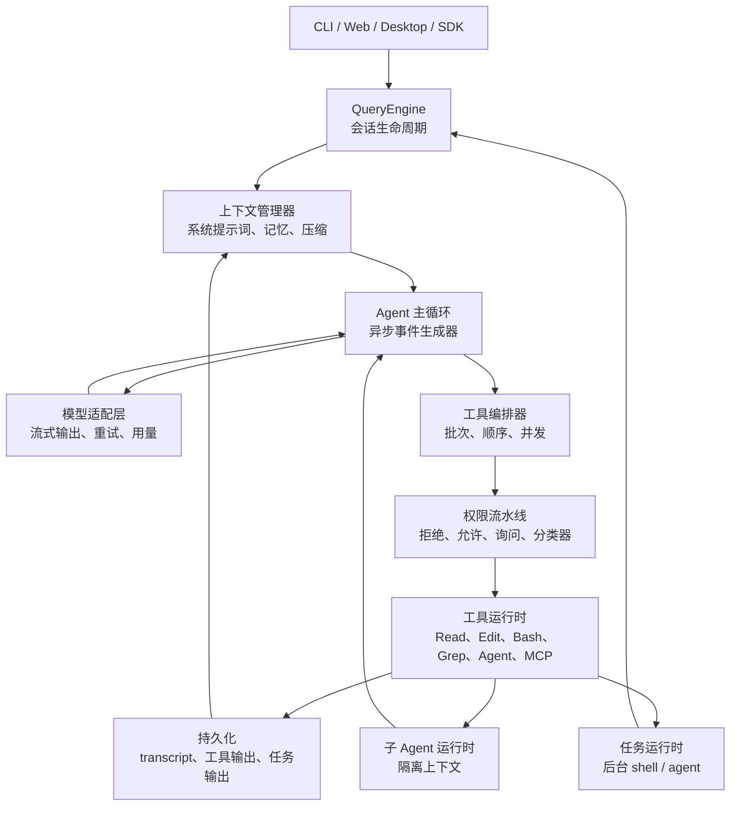

# 先读这里

## 本章目标

让读者快速理解项目目标、关键数字、实施顺序和第一版交付物。

完成本章后，读者应该知道这一层为什么存在、如何实现最小版本、哪些默认值不能随意改、以及如何验收。

如果你的目标是实现框架，请先读 [详细设计索引](./detailed-design/00-index.md)。00-30 章节负责学习路线和总览；真正细到状态机、阈值、接口、伪代码、提示词模板、失败分支和验收用例的内容，放在 `docs/detailed-design/`。

## 核心概念

- 文档入口必须降低上手成本。
- 本章能力必须有清晰的输入、输出、失败语义和测试边界。
- 任何影响模型下一步行为的状态，都必须能被记录、恢复或回放。

## 架构位置

本章位于 `onboarding` 层。它不是孤立模块，而是和主循环、工具系统、上下文管理、持久化、权限或 SDK 事件流共同工作。实现时要明确本层是否拥有状态，是否会产生副作用，是否会改变下一轮模型输入。

## 具体设计

最小设计应包含四个部分：输入对象、输出对象、错误对象和持久化记录。输入对象用于阻止隐式全局依赖；输出对象用于让 UI、SDK 和 replay 共用同一结果；错误对象用于让模型或用户知道下一步怎么恢复；持久化记录用于崩溃后继续运行。

成熟设计还应该补充可观测性和预算控制。只要本章能力可能变慢、变贵、失败或产生副作用，就必须发出事件并记录关键 ID。

## 接口与数据结构

| 边界 | 说明 |
|---|---|
| 输入 | 调用方必须显式传入的状态和参数。 |
| 输出 | 成功时返回的数据、事件或状态变更。 |
| 错误 | 失败时返回给用户、模型或调用方的结构化错误。 |
| 持久化 | 必须写入 transcript、metadata 或输出文件的内容。 |
| 回放 | 回放测试需要记录和模拟的输入输出。 |

建议接口命名保持直接，例如 `onboardingConfig`、`onboardingState`、`onboardingEvent`、`onboardingResult`。如果这些类型变得过大，优先拆分所有权，而不是把所有字段塞进一个全局对象。

## 默认值与关键数字

| 参数名 | 中文含义 | 单位 | 默认值 | 为什么是这个值 | 触发行为 | 调大后果 | 调小后果 |
|---|---|---|---:|---|---|---|---|
| `configSource` | 配置文件入口 | 路径 | `.agent/config.json` | 所有模块从同一个项目级配置入口读取默认值，避免工具、模型和权限各自定义位置。 | 启动或加载项目时读取；缺失时使用内置默认值并提示初始化命令。 | 允许多个入口会让覆盖顺序和问题排查变复杂。 | 没有固定入口会导致项目级覆盖无法稳定生效。 |
| `owner` | 模块所有权标记 | 文本 | `explicit module` | 每个状态字段都必须有唯一负责模块，防止 runtime、工具层和持久化层同时改同一状态。 | 设计数据结构和事件写入点时标注 owner。 | 所有权拆得太细会增加模块间同步和事件转发。 | 所有权太粗会退化成难测试的全局状态对象。 |
| `testMode` | 测试模式要求 | 文本 | `replay case required` | 影响模型下一步行为的模块必须能被 replay 固定输入、工具结果和事件输出。 | 新增模块时至少提供一个正常路径和一个失败路径 replay case。 | 要求更多 replay 会提高稳定性，但 fixture 维护成本上升。 | replay 覆盖不足会让重构后行为漂移难以及时发现。 |

如果本章没有专属数字，就使用 `.agent/config.json` 中的全局默认值；新增参数时也必须补齐“含义、单位、默认值原因、触发行为、调大后果、调小后果”。

## 实现步骤

1. 先实现最小闭环，再添加高级能力。
2. 定义输入、输出、错误和持久化边界。
3. 把默认值集中到配置或常量模块。
4. 为正常路径、失败路径和边界值写测试。
5. 把影响下一轮模型行为的状态写入 transcript、metadata 或 replay fixture。

## 测试与验收

- 正常路径必须产出符合接口的结果。
- 失败路径必须返回结构化错误，而不是静默失败。
- 达到默认限制时必须触发文档规定的行为。
- 恢复或回放时结果必须可解释。
- 相关验收标准必须能被自动化测试验证。

## 常见错误

- 只写概念，没有写输入输出和验收。
- 把默认数字散落在多个实现文件。
- 失败时直接 throw，导致主循环无法恢复。
- 没有 replay case，后续重构容易破坏行为。

## 本章总结

本章的重点是把 `onboarding` 层变成可实现、可测试、可恢复的工程边界。只要边界清楚，后续实现者就不需要靠猜。

## 参考蓝图细节

以下内容保留原始架构蓝图中的细节、表格和代码片段，供实现时逐项对照。

本文档是一份可复用的智能体系统架构规格书。目标不是解释“智能体是什么”，而是给出可以直接照着实现的模块、接口、状态机、阈值、默认配置、失败处理和测试验收标准。

本版对原文档做了 10 轮优化，每一轮对应一个具体交付物：

| 1 | 结构审计 | 明确主路径：入口 -> 会话 -> Agent Loop -> 模型 -> 工具 -> 结果 -> 持久化 |
| 2 | 数字复核 | 增加全局常量表，并区分源码硬默认、可配置默认、推荐默认 |
| 3 | 模块图 | 增加端到端架构图和源码映射表 |
| 4 | 主循环 | 增加状态机、失败路径、必须保持的 transcript invariant |
| 5 | 上下文 | 补充预算公式、200k/1M 两组计算样例、触发顺序 |
| 6 | 工具系统 | 补充工具生命周期、并发边界、结果落盘规则 |
| 7 | 单 Agent MVP | 拆成 4 个开发阶段，每阶段有验收标准 |
| 8 | 多 Agent | 补充子 Agent 隔离、通信、后台任务、权限冒泡 |
| 9 | 生产化 | 补充测试矩阵、观测事件、恢复策略 |
| 10 | 文档收敛 | 统一术语、去掉泛泛建议，把模糊处改成实现约束 |

读完前 10 轮版本后，继续做第 11-20 轮优化。原因：前 10 轮已经覆盖核心 runtime，但一个真正可复用的 Agent 框架还需要 provider 抽象、prompt 组装、配置、存储 schema、SDK/UI 协议、评估回放、安全沙箱、预算控制、多 Agent 合并和部署形态。

| 11 | 工程缺口审计 | 明确还缺模型适配、prompt pipeline、配置、存储、SDK、评估、安全、预算、冲突处理、部署 |
| 12 | 模型适配层 | 增加 ProviderAdapter 接口、重试/退避/stream watchdog 具体数字 |
| 13 | Prompt 组装 | 增加固定上下文顺序、预算分区、工具 schema 注入规则 |
| 14 | 配置系统 | 增加配置优先级、目录结构、环境变量覆盖 |
| 15 | 存储 schema | 增加 transcript、tool output、task、agent metadata 的文件格式 |
| 16 | SDK/UI 协议 | 增加事件流协议、控制消息、前端渲染边界 |
| 17 | 测试评估 | 增加 golden replay、模拟模型、工具 fixture、回归指标 |
| 18 | 安全边界 | 增加 sandbox、路径策略、秘密处理、审计日志 |
| 19 | 成本预算 | 增加 token/cost/tool/task/subagent 预算与速率限制 |
| 20 | 多 Agent 收敛 | 增加文件冲突、worktree merge、部署模式和最终缺口清单 |

这份文档主要从下列源码文件抽取架构，不依赖猜测：

下表是实现一个 Agent 框架时可以直接放进配置文件的默认值。它不是“数字清单”，而是实现规则索引：读者看到任意一行，都应该知道这个参数何时被读取、达到阈值后做什么、改大或改小会破坏什么。

| 参数名 | 中文含义 | 单位 | 默认值 | 为什么是这个值 | 触发行为 | 调大后果 | 调小后果 |
|---|---|---|---:|---|---|---|---|
| `context.window.defaultTokens` | 默认上下文窗口 | tokens | `200_000` | 200k 能覆盖长代码任务和多轮工具结果，又不要求所有 provider 都支持 1M。 | 未指定模型窗口时，预算器按 200k 计算 `effectiveWindow`、压缩线和阻塞线。 | 长任务更少压缩，但每次请求更贵、更慢，摘要更难验证。 | 长任务更早进入 warning、compact 或 block。 |
| `context.window.largeTokens` | 大上下文模型窗口 | tokens | `1_000_000` | 1M 只给长仓库、长 transcript 和多 Agent 汇总使用，避免默认路径过贵。 | 模型路由选择大上下文模型时，把该值交给上下文预算器。 | 可保留更多历史，但成本、延迟和 provider 失败面上升。 | 复杂会话更早需要 full compact 或降级摘要。 |
| `context.compact.summaryReserveTokens` | 压缩摘要/输出预留空间 | tokens | `20_000` | 给模型回答、工具调用和 compact 摘要留空间，防止 prompt 填满窗口。 | 计算 `effectiveWindow = contextWindow - reserve` 时扣除。 | 更早压缩，输出更不容易截断。 | prompt 空间变大，但回答或摘要可能被截断。 |
| `context.compact.autoBufferTokens` | 自动压缩缓冲 | tokens | `13_000` | 给 token 估算误差、工具 schema 和 provider 包装留余量。 | `promptTokens > effectiveWindow - 13_000` 时先自动 compact。 | 压缩更早发生，安全但会增加摘要成本。 | 更晚压缩，prompt too long 风险上升。 |
| `context.compact.warningBufferTokens` | 低上下文警告缓冲 | tokens | `20_000` | 在真正自动压缩前给 UI 和用户预警。 | `promptTokens > autoCompactAt - 20_000` 时发 warning，不改写历史。 | 提醒更早，可能更打扰。 | 提醒更晚，用户更难提前清理上下文。 |
| `context.compact.errorBufferTokens` | 错误态缓冲 | tokens | `20_000` | 第一版让 error 和 warning 使用同一提前量，便于 UI 对齐。 | 低上下文错误提示和 warning 共用该线。 | 错误提示更早出现，用户更早知道需要清理上下文。 | 错误提示更晚，恢复空间更少。 |
| `context.compact.manualReserveTokens` | 阻塞前手动压缩余量 | tokens | `3_000` | 给错误说明、恢复指令和 provider 包装留下最后空间。 | `promptTokens > effectiveWindow - 3_000` 时禁止直接调用模型。 | 更早 block，安全但更容易打断用户。 | 更激进，provider 拒绝概率上升。 |
| `context.compact.maxConsecutiveFailures` | 自动压缩失败熔断次数 | 次 | `3` | 3 次能覆盖偶发模型失败，同时避免无限 compact 循环。 | 自动压缩连续失败达到 3 次后 block，并要求用户确认清理历史或换大窗口模型。 | 恢复机会更多，但成本和等待时间上升。 | 偶发失败更容易直接中断任务。 |
| `model.output.cappedDefaultTokens` | 普通模型输出上限 | tokens | `8_000` | 8k 足够输出计划、解释和工具调用，不会过度挤占 prompt。 | 普通模型调用未显式指定输出上限时使用。 | 长回答更完整，但上下文可输入空间减少。 | 回答、patch 说明或工具参数更容易被截断。 |
| `model.output.escalatedRetryTokens` | 输出截断恢复上限 | tokens | `64_000` | 只在 finish reason 为 max output 时使用，给长修复结果一次更大输出空间。 | 输出被截断后，最多升级到 64k 重试。 | 截断恢复能力更强，但成本和延迟明显上升。 | 长结果仍可能反复截断。 |
| `tool.maxConcurrency` | 工具并发上限 | 个 | `10` | 10 适合成熟版只读工具批处理，能提速又不让事件流爆炸。 | 同一批只读 tool_use 超过 10 个时排队到下一批。 | 只读扫描更快，但 IO、日志和结果排序压力上升。 | 执行更稳，但大型检索更慢。 |
| `tool.result.defaultPersistChars` | 工具结果落盘阈值 | 字符 | `50_000` | 50k 以上结果会明显挤占 prompt，落盘能保存完整内容。 | 工具输出超过 50k 字符时写入 `tool-results` 文件，prompt 里只放摘要和路径。 | 模型能直接看到更多输出，但上下文更快膨胀。 | 更早落盘，模型需要二次读取才能看完整结果。 |
| `tool.result.perMessageChars` | 单条消息工具结果总预算 | 字符 | `200_000` | 防止单个 provider message 因多个 tool_result 过大而被拒绝。 | 映射 provider 消息前统计，超过时拆分、落盘或微压缩。 | 大批工具结果更少拆分，但请求体更容易过大。 | 更多结果变成外部引用，模型直接可见信息减少。 |
| `tool.result.hardBudgetTokens` | 工具结果硬预算 | tokens | `100_000` | 给一次回合内工具结果设置绝对上限，防止压垮上下文预算。 | 工具结果估算超过 100k tokens 时必须 microcompact 或落盘。 | 保留更多原始工具事实，但会挤掉最近对话。 | 更早压缩工具输出，可能丢失边缘日志。 |
| `tool.result.bytesPerToken` | 粗略 token 估算比例 | 字符/Token | `4` | 英文日志和代码大致可按 4 字符 1 token 估算，足够做预算预警。 | 没有 tokenizer 时用 `chars / 4` 估算工具结果 token。 | 估算更保守，会更早落盘。 | 估算更乐观，可能低估上下文压力。 |
| `tool.result.previewBytes` | 落盘输出预览大小 | 字节 | `2_000` | 2KB 通常能包含错误头、文件路径和第一段关键信息。 | 工具结果落盘后，把前 2KB 作为 preview 放入 prompt。 | 模型直接看到更多原文，但 prompt 更臃肿。 | preview 可能看不到真正错误位置。 |
| `bash.timeout.defaultMs` | Bash 默认超时 | 毫秒 | `120_000` | 120 秒覆盖多数测试、构建前置检查和脚本。 | Bash 未显式设置 timeout 时使用，超时后返回 timeout 错误。 | 慢命令更可能跑完，但主循环等待更久。 | 正常测试可能被误杀。 |
| `bash.timeout.maxMs` | Bash 最大超时 | 毫秒 | `600_000` | 10 分钟允许大型构建，但不允许无限占用执行器。 | 用户或模型请求更长 timeout 时截断到 600k。 | 大任务更容易完成，但资源锁定更久。 | 大型项目构建更容易失败。 |
| `bash.progressAfterMs` | Bash 进度提示延迟 | 毫秒 | `2_000` | 超过 2 秒无结果时，用户需要知道命令仍在跑。 | Bash 运行超过 2 秒发 progress 事件。 | UI 更安静，但用户更晚知道进度。 | UI 更频繁，短命令也可能产生噪音。 |
| `bash.autoBackgroundAfterMs` | 自动后台任务阈值 | 毫秒 | `15_000` | 15 秒后仍未结束的命令通常应从交互回合移到后台观察。 | 命令超过 15 秒时提示或切换后台任务模式。 | 前台等待更久，交互体验变慢。 | 更早后台化，短构建可能被过度拆分。 |
| `bash.blockSleepSecondsGte` | 独立 sleep 阻断阈值 | 秒 | `2` | 单独长 sleep 对 Agent 进展价值低，常见于误用或占位。 | 检测到独立 `sleep >= 2` 秒时要求改用任务/心跳机制。 | 允许更长空等，浪费执行时间。 | 连很短的等待也会被拒绝，影响脚本兼容。 |
| `read.output.maxTokens` | Read 输出上限 | tokens | `25_000` | 单次读取给模型足够文件上下文，但不让一个文件吃掉整轮预算。 | Read 输出估算超过 25k tokens 时截断并提示范围读取。 | 大文件一次可见更多，但上下文压力更高。 | 需要更多分段读取，定位速度下降。 |
| `read.file.maxSizeBytes` | Read 文件大小上限 | 字节 | `256 KB` | 256KB 适合直接读源码文件；更大的文件通常需要分段或专用解析。 | 文件超过上限时拒绝整文件读取，要求 range read。 | 大文件更少被拒绝，但容易把日志/构建产物塞进上下文。 | 普通长源码也可能需要分段读取。 |
| `read.cache.entries` | Read 缓存条数 | 个 | `100` | 100 个文件足以覆盖一次普通任务的热点文件集合。 | 读取第 101 个文件时按 LRU 淘汰旧缓存。 | 重复读取更快，但内存占用增加。 | 更频繁重新读取文件。 |
| `read.cache.memoryBytes` | Read 缓存内存上限 | 字节 | `25 MB` | 25MB 能缓存一次普通代码任务的热点文件，同时不会明显挤占本地运行内存。 | 缓存总量超过 25MB 时淘汰旧条目。 | 大仓库重复读取更快，但内存压力上升。 | 缓存命中率下降，更多文件需要重新读取。 |
| `grep.defaultHeadLimit` | Grep 返回条数上限 | 条 | `250` | 250 条足够判断模式分布，又不会把搜索结果变成长日志。 | Grep 未指定上限时最多返回 250 条。 | 搜索更完整，但 prompt 更容易被列表淹没。 | 可能漏掉后面的关键匹配。 |
| `glob.defaultMaxResults` | Glob 返回路径上限 | 条 | `100` | 100 条路径足够选择下一步搜索或读取目标。 | Glob 未指定上限时最多返回 100 条路径。 | 文件分布更完整，但路径列表更吵。 | 大目录下更容易漏候选文件。 |
| `edit.maxFileSizeBytes` | 可编辑文件大小上限 | 字节 | `1 GiB` | 编辑器层面允许大文件，但实际读写仍受 Read 和权限策略约束。 | 编辑前检查文件大小，超过时拒绝自动编辑。 | 允许极大文件自动改写，风险和耗时上升。 | 大型生成文件更早被拒绝。 |
| `agent.fork.maxTurns` | fork Agent 最大轮数 | 轮 | `200` | fork 任务用于长调查或后台验证，需要比普通子 Agent 更长。 | fork 子 Agent 达到 200 轮后停止并返回 partial summary。 | 长调查更完整，但成本和漂移风险上升。 | 复杂调查更容易中途结束。 |
| `agent.default.maxTurns` | 普通子 Agent 最大轮数 | 轮 | `20` | 普通子 Agent 应解决一个明确子问题，20 轮足够探索、读取、总结。 | 子 Agent 达到 20 轮后停止并把当前状态摘要给父 Agent。 | 子 Agent 更独立，但可能跑偏和抢预算。 | 父 Agent 更频繁重新派发任务。 |
| `agent.mcp.waitMaxMs` | MCP 连接等待上限 | 毫秒 | `30_000` | 30 秒覆盖本地 MCP server 启动和握手，避免一直等待不可用服务。 | 等待 MCP ready 超过 30 秒后标记 server unavailable。 | 慢服务更可能连接成功，但启动卡住更久。 | 慢启动 MCP 更容易被误判失败。 |
| `agent.mcp.pollIntervalMs` | MCP ready 轮询间隔 | 毫秒 | `500` | 500ms 能及时发现 ready，又不会高频轮询。 | 等待 MCP 时每 500ms 检查一次状态。 | 轮询更少，ready 感知更慢。 | 轮询更频繁，浪费本地资源。 |
| `agent.progressHintAfterMs` | 子 Agent 进度提示延迟 | 毫秒 | `2_000` | 子 Agent 超过 2 秒无结果时，父 Agent/UI 需要知道它仍在执行。 | 子 Agent 运行超过 2 秒发 progress hint。 | UI 更安静，但父 Agent 更晚知道状态。 | 进度事件更多，事件流更吵。 |
| `agent.uiProgressMessages` | UI 展示进度条数 | 条 | `3` | UI 同时展示 3 条子任务进度，既能说明状态又不占满界面。 | 超过 3 条时折叠或汇总展示。 | UI 展示更完整，但更拥挤。 | 用户更难看出并行任务状态。 |
| `web.urlMaxChars` | URL 长度上限 | 字符 | `2_000` | 2k 覆盖绝大多数 URL，能拦住异常长 query 或注入式输入。 | URL 超过 2k 字符时拒绝抓取并要求用户确认。 | 特殊长链接可直接抓取，但日志和安全风险上升。 | 合法长链接可能需要手动缩短。 |
| `web.httpMaxBytes` | HTTP 内容上限 | 字节 | `10 MB` | 10MB 足以抓取网页和小型文档，避免下载大文件。 | 响应体超过 10MB 时停止读取并落盘或报错。 | 可处理更大网页/文件，但内存和上下文处理压力上升。 | 较大网页更容易被截断。 |
| `web.fetchTimeoutMs` | Fetch 超时 | 毫秒 | `60_000` | 60 秒覆盖慢网页和重定向链，避免网络请求卡住。 | Fetch 超过 60 秒返回 timeout。 | 慢站点更可能成功，但任务等待更久。 | 慢站点更容易失败，需要用户换来源或稍后重试。 |
| `web.maxRedirects` | 最大重定向次数 | 次 | `10` | 10 次足够覆盖登录跳转和短链，能拦住重定向循环。 | 第 11 次重定向时停止并返回 redirect_limit_exceeded。 | 复杂跳转更可能成功，但循环检测更晚。 | 合法多跳链接更容易失败。 |
| `media.imageMaxBase64Bytes` | 单图 base64 上限 | 字节 | `5 MB` | 5MB 足够普通截图和照片，避免把图片转文本后挤爆请求体。 | 图片 base64 超过 5MB 时要求压缩或改用文件引用。 | 高清图更少被拒绝，但请求体更大。 | 普通截图也可能需要压缩。 |
| `media.imageMaxWidthPx` | 图片宽度上限 | 像素 | `2_000` | 2000px 宽足以看清 UI 和文档截图。 | 图片超过宽度上限时先缩放再发送模型。 | 细节更多，但视觉 token 和传输成本上升。 | 小字和细线更容易丢失。 |
| `media.imageMaxHeightPx` | 图片高度上限 | 像素 | `2_000` | 2000px 高能覆盖常见长截图的关键区域。 | 图片超过高度上限时缩放或裁切。 | 长图保留更多，但成本更高。 | 长页面更容易丢下半部分信息。 |
| `media.maxItemsPerRequest` | 单请求媒体数量上限 | 个 | `100` | 100 个媒体项是硬防线，防止一次请求夹带大量图片。 | 媒体项超过 100 个时拒绝或要求分批。 | 批量分析更方便，但请求更不稳定。 | 大批图片需要更多轮处理。 |
| `api.retry.defaultMaxRetries` | API 默认重试次数 | 次 | `10` | 10 次覆盖短暂 429/5xx 波动，同时避免无限打 provider。 | 可恢复错误达到 10 次后 fallback 或失败。 | 临时故障恢复概率更高，但等待和费用上升。 | 短暂抖动更容易暴露给用户。 |
| `api.retry.baseDelayMs` | 重试退避起点 | 毫秒 | `500` | 500ms 对瞬时错误恢复足够快，又不会立即打满 provider。 | 第一次可恢复错误后等待 500ms，再指数退避。 | 请求更温和，但恢复更慢。 | 恢复更快，但可能加重限流。 |
| `api.retry.maxDelayMs` | 普通退避上限 | 毫秒 | `32_000` | 32 秒限制交互任务等待，不让单次退避过长。 | 指数退避超过 32 秒时封顶。 | 对 provider 更友好，但用户等待更久。 | 更快失败或重试，限流期间更容易继续撞墙。 |
| `api.retry.jitterRatio` | 退避随机抖动比例 | 比例 | `0.25` | 25% 抖动能分散并发客户端的重试峰值。 | 每次退避在基础延迟上加入随机抖动。 | 重试更分散，但时长更不可预测。 | 重试更整齐，容易形成同一时间的重试峰。 |
| `api.retry.maxConsecutive529` | 连续 overload 阈值 | 次 | `3` | 连续 3 次 529 通常说明主模型过载，不应继续硬打。 | 连续 529 达到 3 次后 fallback 或明确失败。 | 给主模型更多恢复机会，但浪费时间。 | 更快 fallback，但可能错过短暂恢复。 |
| `api.retry.persistentMaxBackoffMs` | 无人值守最大退避 | 毫秒 | `300_000` | 后台任务可等 5 分钟，交互任务不默认使用。 | 无人值守任务退避超过 300k 时封顶。 | 后台更少失败，但恢复慢。 | 后台任务更快失败，需要用户或调度器重新启动。 |
| `api.retry.persistentResetCapMs` | 等待 reset 最大时长 | 毫秒 | `21_600_000` | 6 小时适合等待日内配额 reset，超过后应让用户介入。 | reset 等待超过 6 小时后停止自动等待。 | 任务可能等更久但更少失败。 | 长配额恢复无法自动完成。 |
| `api.retry.heartbeatMs` | 长等待心跳间隔 | 毫秒 | `30_000` | 长等待期间每 30 秒记录一次状态，证明任务没丢。 | 后台等待时每 30 秒写 heartbeat。 | 日志更少，但恢复时难判断是否卡死。 | 日志更密，存储和事件噪音增加。 |
| `api.retry.floorOutputTokens` | 输出调整下限 | tokens | `3_000` | 即使降输出预算，也保留 3k 让模型能说明结果或错误。 | 降级重试时输出上限不得低于 3k。 | 输出更完整，但 prompt 空间更少。 | 模型可能没有足够空间解释恢复步骤。 |
| `api.stream.idleTimeoutMs` | 流式空闲超时 | 毫秒 | `90_000` | 90 秒允许长思考和慢流式输出，也能识别断流。 | stream 90 秒无任何事件时中断并按重试表处理。 | 慢响应更少误杀，但断流发现更晚。 | 长回答更容易被误判 idle。 |
| `api.nonstreamingFallback.localTimeoutMs` | 本地非流式 fallback 超时 | 毫秒 | `300_000` | 本地环境可等待 5 分钟，给长模型调用一个恢复窗口。 | 本地非流式 fallback 超过 300k 后失败。 | 长调用更可能完成，但 UI 等待更久。 | 长调用更容易失败，需要改用流式或拆小任务。 |
| `api.nonstreamingFallback.remoteTimeoutMs` | 远程非流式 fallback 超时 | 毫秒 | `120_000` | 远程环境资源更贵，2 分钟后应释放 worker。 | 远程非流式 fallback 超过 120k 后失败。 | 远程长调用更少失败，但 worker 占用更久。 | 远程任务更快释放资源，但长回答更容易中断。 |



每一轮 Agent turn 都按这个顺序执行，顺序不要打乱：

1. 用户消息先写入 transcript。
2. Context Manager 组装可发送上下文。
3. Model Adapter 发起 streaming 请求。
4. Agent Loop 收集 assistant 文本和 `tool_use`。
5. Tool Orchestrator 执行工具。
6. 每个 `tool_use_id` 必须生成一个匹配的 `tool_result`。
7. 大工具结果先落盘，再把预览和文件路径交给模型。
8. Context Manager 判断是否需要 microcompact/full compact。
9. 状态写回 session。
10. 如果还有工具结果，进入下一轮；否则结束。

如果你要从零实现，不要从多 Agent 开始。按这个顺序做：

| 1 | 单轮聊天 + streaming | 工具、记忆、多 Agent | 用户输入能得到流式回答 |
| 2 | `Read/Grep/Glob` | 写文件、后台任务 | Agent 能自己查代码 |
| 3 | `Bash/Edit/Write` + 权限 | 自动模式、复杂插件 | Agent 能安全改代码 |
| 4 | transcript + tool output persistence | 长期记忆 | 进程重启后能恢复 |
| 5 | context compact | 多 Agent | 200k 上下文不会炸 |
| 6 | `Agent` tool + sidechain transcript | 多个写入型 Agent | 父 Agent 能委派只读任务 |
| 7 | async task runtime | 远程 teammate | 后台任务可查、可停 |
| 8 | named agents + worktrees | 自主 swarm | 多 Agent 不互相覆盖文件 |

```text
先保证单 Agent 可靠。
再扩展多 Agent 能力。
最后才考虑自主集群行为。
```

本规格书适合构建以下三类系统：

- 单 Agent 编程助手；
- 多 Agent 本地自动化系统；
- 带工具、权限、记忆和后台 worker 的生产级 Agent 平台。

它来自当前 Claude Code 源码快照里能观察到的架构模式，但写法是可复用实现规格，不是源码摘要。

这一节是给“拿到文档就要开工的人”看的。先按这里做，不需要先读完整文档。

第一版目标：

```text
一个本地单 Agent CLI：
- 能流式回答；
- 能 Read/Grep/Glob 查代码；
- 能 Bash 跑命令；
- 能 Edit/Write 改文件；
- 有权限控制；
- 有 transcript；
- 大工具结果会落盘；
- 接近 200k context 时会 compact；
- 后续能加 Agent tool 变多 Agent。
```

第一版不要做：

```text
- swarm；
- 多个写入型 Agent；
- 远程 worker；
- 复杂 UI；
- 自动浏览器；
- 长期向量记忆；
- 自主循环调度。
```

直接按这个目录建项目：

```text
agent-framework/
  package.json
  tsconfig.json
  src/
    index.ts
    cli.ts
    runtime/
      QueryEngine.ts
      queryLoop.ts
      events.ts
      errors.ts
    model/
      ProviderAdapter.ts
      ClaudeAdapter.ts
      retry.ts
      tokenBudget.ts
    context/
      ContextManager.ts
      promptAssembly.ts
      compact.ts
      tokenCount.ts
    messages/
      Message.ts
      providerFormat.ts
      validateToolPairs.ts
    tools/
      Tool.ts
      registry.ts
      orchestration.ts
      execution.ts
      builtin/
        ReadTool.ts
        GrepTool.ts
        GlobTool.ts
        BashTool.ts
        EditTool.ts
        WriteTool.ts
        TodoWriteTool.ts
    permissions/
      PermissionEngine.ts
      rules.ts
      audit.ts
    storage/
      TranscriptStore.ts
      ToolOutputStore.ts
      SessionStore.ts
    tasks/
      TaskStore.ts
      LocalShellTask.ts
    agents/
      AgentTool.ts
      runSubagent.ts
      loadAgentDefinitions.ts
    config/
      defaultConfig.ts
      loadConfig.ts
      schema.ts
    eval/
      replay.ts
      fakeModel.ts
      fixtures/
  .agent/
    config.json
    permissions.json
    agents/
      explore.md
      verify.md
```

按文件顺序实现：

| 1 | `messages/Message.ts`, `runtime/events.ts` | 内部消息和事件类型固定 |
| 2 | `model/ProviderAdapter.ts`, `model/ClaudeAdapter.ts` | 能流式调用模型 |
| 3 | `runtime/queryLoop.ts` | 用户输入 -> 模型输出主循环跑通 |
| 4 | `tools/Tool.ts`, `tools/registry.ts` | 工具协议固定 |
| 5 | `ReadTool`, `GrepTool`, `GlobTool` | Agent 能看代码 |
| 6 | `validateToolPairs.ts` | 每次模型请求前 transcript 合法 |
| 7 | `permissions/*` | 写文件和危险命令可控 |
| 8 | `BashTool`, `EditTool`, `WriteTool` | Agent 能执行和修改 |
| 9 | `storage/*` | transcript 和大输出可恢复 |
| 10 | `context/*` | token 预算和 compact |
| 11 | `tasks/*` | Bash 后台任务 |
| 12 | `agents/*` | 多 Agent 扩展 |

把这份放到 `.agent/config.json`：

```json
{
  "model": {
    "mainModel": "claude-sonnet-4-6",
    "fallbackModel": "claude-sonnet-4-6",
    "compactModel": "claude-sonnet-4-6",
    "classifierModel": "claude-haiku-4"
  },
  "context": {
    "contextWindowTokens": 200000,
    "compactSummaryReserveCapTokens": 20000,
    "autoCompactBufferTokens": 13000,
    "manualCompactReserveTokens": 3000,
    "warningBufferTokens": 20000,
    "errorBufferTokens": 20000,
    "maxConsecutiveAutoCompactFailures": 3
  },
  "modelOutput": {
    "cappedDefaultTokens": 8000,
    "escalatedRetryTokens": 64000,
    "maxOutputRecoveryTurns": 3
  },
  "apiRetry": {
    "defaultMaxRetries": 10,
    "baseDelayMs": 500,
    "maxDelayMs": 32000,
    "jitterRatio": 0.25,
    "maxConsecutive529": 3,
    "streamIdleTimeoutMs": 90000,
    "nonStreamingFallbackTimeoutMs": 300000,
    "remoteNonStreamingFallbackTimeoutMs": 120000
  },
  "tools": {
    "maxConcurrency": 10,
    "mvpMaxConcurrency": 4,
    "defaultResultPersistChars": 50000,
    "perMessageResultChars": 200000,
    "hardBudgetTokens": 100000,
    "previewBytes": 2000
  },
  "bash": {
    "defaultTimeoutMs": 120000,
    "maxTimeoutMs": 600000,
    "progressAfterMs": 2000,
    "autoBackgroundAfterMs": 15000,
    "blockStandaloneSleepSecondsGte": 2
  },
  "read": {
    "maxOutputTokens": 25000,
    "maxSizeBytes": 262144,
    "cacheEntries": 100,
    "cacheMemoryBytes": 26214400
  },
  "search": {
    "grepDefaultHeadLimit": 250,
    "globDefaultMaxResults": 100
  },
  "agents": {
    "defaultMaxTurns": 20,
    "forkMaxTurns": 200,
    "maxConcurrentSubagents": 4,
    "mcpWaitMaxMs": 30000,
    "mcpPollIntervalMs": 500,
    "progressHintAfterMs": 2000,
    "uiProgressMessages": 3
  },
  "storage": {
    "maxSessionBytes": 1073741824,
    "transcriptMaxLineBytes": 1048576
  },
  "budgets": {
    "maxToolCallsPerTurn": 30,
    "maxAgentSpawnsPerTurn": 3,
    "maxWallClockMsPerTurn": 900000,
    "maxBackgroundTasks": 8
  }
}
```

```ts
export type Message =
  | UserMessage
  | AssistantMessage
  | ToolResultMessage
  | SystemMessage
  | ProgressMessage

export type UserMessage = {
  uuid: string
  type: "user"
  createdAt: string
  content: string | ContentBlock[]
  isMeta?: boolean
}

export type AssistantMessage = {
  uuid: string
  type: "assistant"
  createdAt: string
  content: ContentBlock[]
  providerRequestId?: string
}

export type ToolResultMessage = {
  uuid: string
  type: "tool_result"
  createdAt: string
  toolUseId: string
  toolName: string
  ok: boolean
  content: string | ContentBlock[]
}

export type ContentBlock =
  | { type: "text"; text: string }
  | { type: "tool_use"; id: string; name: string; input: unknown }
  | { type: "tool_result"; toolUseId: string; content: string; isError?: boolean }
```

```ts
export type Tool<Input = unknown, Output = unknown> = {
  name: string
  inputSchema: unknown
  maxResultSizeChars: number
  isReadOnly(input: Input): boolean
  isConcurrencySafe(input: Input): boolean
  validateInput?(input: Input, ctx: ToolUseContext): Promise<void>
  checkPermissions(input: Input, ctx: ToolUseContext): Promise<PermissionDecision>
  call(input: Input, ctx: ToolUseContext): Promise<ToolResult<Output>>
}

export type ToolResult<Output = unknown> =
  | { ok: true; data: Output; displayText?: string }
  | { ok: false; error: string; recoverable: boolean }
```

```ts
export type QueryEvent =
  | { type: "assistant_delta"; text: string }
  | { type: "assistant_message"; message: AssistantMessage }
  | { type: "tool_use_start"; toolUseId: string; name: string; input: unknown }
  | { type: "tool_progress"; toolUseId: string; data: unknown }
  | { type: "tool_result"; message: ToolResultMessage }
  | { type: "permission_request"; request: PermissionRequest }
  | { type: "compact_boundary"; preTokens: number; postTokens: number }
  | { type: "error"; error: RuntimeError }
  | { type: "done"; reason: TerminalReason }
```

第一版主循环只需要这样：

```ts
export async function* queryLoop(params: QueryParams): AsyncGenerator<QueryEvent> {
  let messages = params.messages
  let turnCount = 0

  while (true) {
    const prompt = await params.contextManager.buildPrompt(messages)
    const assistant: AssistantMessage = await collectAssistantMessage(
      params.provider.stream(prompt, params.callContext),
      event => {
        if (event.type === "assistant_delta") params.emit(event)
      },
    )

    messages.push(assistant)
    yield { type: "assistant_message", message: assistant }

    const toolUses = extractToolUses(assistant)
    if (toolUses.length === 0) {
      yield { type: "done", reason: "completed" }
      return
    }

    const toolResults = await params.toolOrchestrator.run(toolUses, {
      ...params.toolUseContext,
      messages,
    })

    for (const result of toolResults) {
      messages.push(result)
      yield { type: "tool_result", message: result }
    }

    validateToolPairsOrThrow(messages)

    turnCount++
    if (params.maxTurns && turnCount >= params.maxTurns) {
      yield { type: "done", reason: "max_turns" }
      return
    }
  }
}
```

第二版再加：

```text
- 工具流式执行；
- 触发式上下文压缩；
- max_output_tokens 恢复；
- fallback model 降级；
- 停止钩子；
- 后台任务；
- 子 Agent。
```

如果一个工程师全职做，按这个节奏：

| 天数 | 实现内容 | 验收结果 |
|---:|---|---|
| 1 | 消息类型、ProviderAdapter、流式模型调用 | 输入一句话能流式输出 |
| 2 | 工具协议、工具注册表、Read / Grep / Glob | 模型能读文件、搜代码 |
| 3 | 工具编排、工具配对校验器 | 两个并发 Read 返回顺序正确 |
| 4 | PermissionEngine、Bash / Edit / Write | Edit 未 Read 会失败；危险 Bash 会要求确认 |
| 5 | TranscriptStore、ToolOutputStore | 进程重启能恢复；75k 输出会落盘 |
| 6 | ContextManager、token 预算、压缩占位实现 | 167k tokens 触发 compact |
| 7 | AgentTool 同步版本、sidechain transcript | Explore Agent 能只读调查并返回 |

项目交付前必须跑过这些：

```text
1. 本文档。
2. 0.6.2 的项目骨架。
3. 0.6.4 的默认配置。
4. 0.6.5 的接口定义。
5. 0.6.7 的七天开发计划。
6. 0.6.8 的验收测试。
```

```text
一个可靠的单 Agent 主循环：能调用工具，能从失败中恢复，
能持久化 transcript，并且永远不发送非法的 tool_use / tool_result 配对。
```
