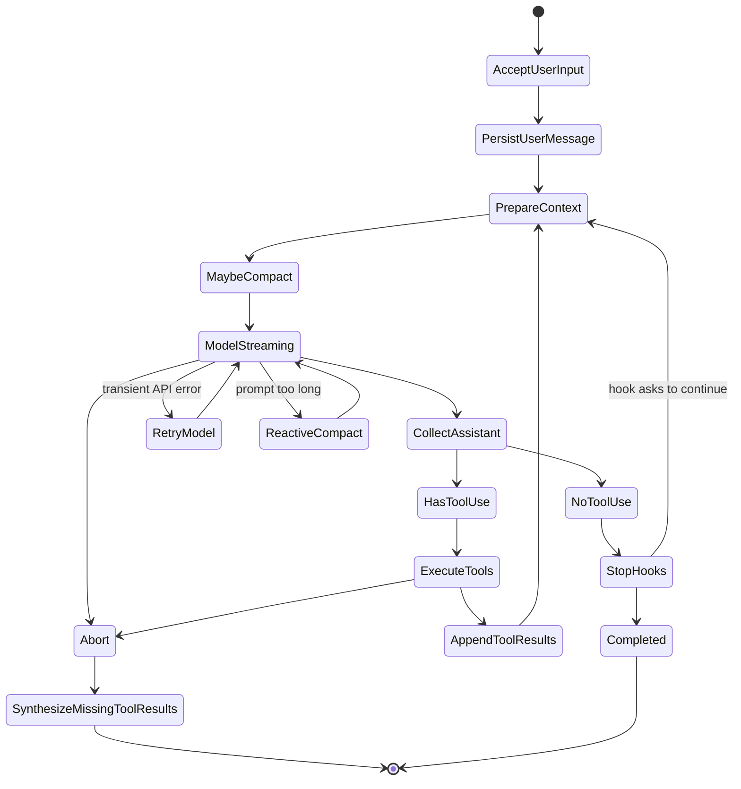

# 核心运行时模型 / Core Runtime Model

## 本章目标 / Goals

定义消息模型、主循环、状态机、失败恢复和 transcript 合法性。

Define the message model, main loop, state machine, failure recovery, and transcript validity.

完成本章后，读者应该知道这一层为什么存在、如何实现最小版本、哪些默认值不能随意改、以及如何验收。

After this chapter, the reader should know why this layer exists, how to implement the minimal version, which defaults must not be changed casually, and how to validate it.

## 核心概念 / Core Concepts

- 主循环是 Agent 系统的心脏。
- 本章能力必须有清晰的输入、输出、失败语义和测试边界。
- 任何影响模型下一步行为的状态，都必须能被记录、恢复或回放。

- The main loop is the heart of an agent system.
- This capability must have clear input, output, failure semantics, and test boundaries.
- Any state that affects the model's next action must be recordable, recoverable, or replayable.

## 架构位置 / Where This Fits

本章位于 `runtime` 层。它不是孤立模块，而是和主循环、工具系统、上下文管理、持久化、权限或 SDK 事件流共同工作。实现时要明确本层是否拥有状态，是否会产生副作用，是否会改变下一轮模型输入。

This chapter belongs to the `runtime` layer. It is not an isolated module; it works with the main loop, tool system, context management, persistence, permissions, or SDK event stream. Implementation must make clear whether this layer owns state, produces side effects, or changes the next model input.

## 具体设计 / Concrete Design

最小设计应包含四个部分：输入对象、输出对象、错误对象和持久化记录。输入对象用于阻止隐式全局依赖；输出对象用于让 UI、SDK 和 replay 共用同一结果；错误对象用于让模型或用户知道下一步怎么恢复；持久化记录用于崩溃后继续运行。

The minimal design should contain four parts: input object, output object, error object, and persistence record. The input object prevents hidden global dependencies; the output object lets UI, SDK, and replay share the same result; the error object tells the model or user how to recover; the persistence record lets execution continue after a crash.

成熟设计还应该补充可观测性和预算控制。只要本章能力可能变慢、变贵、失败或产生副作用，就必须发出事件并记录关键 ID。

A mature design should also include observability and budget control. If this capability can become slow, expensive, fail, or produce side effects, it must emit events and record key IDs.

## 接口与数据结构 / Interfaces And Data Structures

| 边界 / Boundary | 中文说明 | English Description |
|---|---|---|
| Input | 调用方必须显式传入的状态和参数。 | Explicit state and parameters required from the caller. |
| Output | 成功时返回的数据、事件或状态变更。 | Data, events, or state changes returned on success. |
| Error | 失败时返回给用户、模型或调用方的结构化错误。 | Structured errors returned to the user, model, or caller. |
| Persistence | 必须写入 transcript、metadata 或输出文件的内容。 | Content that must be written to transcript, metadata, or output files. |
| Replay | 回放测试需要记录和模拟的输入输出。 | Inputs and outputs replay tests must record and simulate. |

建议接口命名保持直接，例如 `runtimeConfig`、`runtimeState`、`runtimeEvent`、`runtimeResult`。如果这些类型变得过大，优先拆分所有权，而不是把所有字段塞进一个全局对象。

Use direct names such as `runtimeConfig`, `runtimeState`, `runtimeEvent`, and `runtimeResult`. If these types become too large, split ownership instead of putting every field into one global object.

## 默认值与关键数字 / Defaults And Numbers

| 配置 / Config | 默认值 / Default | 说明 / Notes |
|---|---:|---|
| `configSource` | `.agent/config.json` | 实现时显式引用，不要隐藏在业务逻辑中。 / Reference explicitly in implementation; do not hide it in business logic. |
| `owner` | `explicit module` | 实现时显式引用，不要隐藏在业务逻辑中。 / Reference explicitly in implementation; do not hide it in business logic. |
| `testMode` | `replay case required` | 实现时显式引用，不要隐藏在业务逻辑中。 / Reference explicitly in implementation; do not hide it in business logic. |

如果本章没有专属数字，就使用 `.agent/config.json` 中的全局默认值，并在实现中显式引用。不要让默认值只存在于文档里。

If this chapter has no dedicated numbers, use the global defaults in `.agent/config.json` and reference them explicitly in implementation. Defaults should not live only in documentation.

## 实现步骤 / Implementation Steps

1. 先实现最小闭环，再添加高级能力。
2. 定义输入、输出、错误和持久化边界。
3. 把默认值集中到配置或常量模块。
4. 为正常路径、失败路径和边界值写测试。
5. 把影响下一轮模型行为的状态写入 transcript、metadata 或 replay fixture。

1. Implement the minimal closed loop before adding advanced capabilities.
2. Define input, output, error, and persistence boundaries.
3. Centralize defaults in config or constants.
4. Write tests for happy paths, failure paths, and boundary values.
5. Write state that affects the next model turn into transcript, metadata, or replay fixtures.

## 测试与验收 / Tests And Acceptance Criteria

- 正常路径必须产出符合接口的结果。
- 失败路径必须返回结构化错误，而不是静默失败。
- 达到默认限制时必须触发文档规定的行为。
- 恢复或回放时结果必须可解释。
- 相关验收标准必须能被自动化测试验证。

- The happy path must produce results matching the interface.
- Failure paths must return structured errors instead of failing silently.
- At default limits, behavior must match this document.
- Resume or replay results must be explainable.
- Acceptance criteria must be verifiable by automated tests.

## 常见错误 / Common Mistakes

- 只写概念，没有写输入输出和验收。
- 把默认数字散落在多个实现文件。
- 失败时直接 throw，导致主循环无法恢复。
- 没有 replay case，后续重构容易破坏行为。

- Writing concepts without inputs, outputs, and acceptance criteria.
- Scattering default numbers across implementation files.
- Throwing on failure so the main loop cannot recover.
- Skipping replay cases, making future refactors risky.

## 本章总结 / Summary

本章的重点是把 `runtime` 层变成可实现、可测试、可恢复的工程边界。只要边界清楚，后续实现者就不需要靠猜。

The focus of this chapter is to turn the `runtime` layer into an implementable, testable, and recoverable engineering boundary. When boundaries are clear, implementers do not need to guess.

## 参考蓝图细节 / Reference Blueprint Details

以下内容保留原始架构蓝图中的细节、表格和代码片段，供实现时逐项对照。

The following section preserves the detailed tables, code snippets, and notes from the original architecture blueprint for implementation reference.

## 2.1 Message Types

Use a normalized internal message model. Do not store raw provider messages everywhere.

Recommended message union:

```ts
type Message =
  | UserMessage
  | AssistantMessage
  | ToolResultMessage
  | SystemMessage
  | ProgressMessage
  | AttachmentMessage
  | TombstoneMessage
```

Required fields:

| Field | Purpose |
|---|---|
| `uuid` | Local stable message ID |
| `type` | Message kind |
| `createdAt` | Ordering and persistence |
| `parentUuid?` | Transcript continuity |
| `source?` | user, tool, system, agent, hook |
| `isMeta?` | Hidden/control message not authored by user |
| `toolUseResult?` | Human-readable tool result summary |

Assistant messages must preserve model tool-use blocks exactly enough to replay them. Tool result messages must preserve `tool_use_id` so provider APIs can validate pairing.

## 2.2 Main Agent Loop

The core loop should be an async generator so UI, SDK, and task systems can stream events.

```ts
async function* query(params: QueryParams): AsyncGenerator<QueryEvent, Terminal> {
  let state = createInitialLoopState(params)

  while (true) {
    const messagesForQuery = await prepareContext(state)

    yield { type: "stream_request_start" }

    const assistantMessages = []
    const toolUseBlocks = []

    for await (const event of callModelStream(messagesForQuery, state)) {
      yield event

      if (event.type === "assistant") {
        assistantMessages.push(event)
        toolUseBlocks.push(...extractToolUses(event))
      }
    }

    if (state.abortController.signal.aborted) {
      yield* synthesizeMissingToolResults(assistantMessages)
      return { reason: "aborted" }
    }

    if (toolUseBlocks.length === 0) {
      const stop = await runStopHooks(state, assistantMessages)
      if (stop.shouldContinue) {
        state = appendMetaUserMessage(state, stop.message)
        continue
      }
      return { reason: "completed" }
    }

    const toolResults = []
    for await (const update of runTools(toolUseBlocks, state.toolContext)) {
      yield update
      toolResults.push(update)
    }

    state = {
      ...state,
      messages: [
        ...messagesForQuery,
        ...assistantMessages,
        ...toolResults,
      ],
      turnCount: state.turnCount + 1,
    }

    if (state.maxTurns && state.turnCount > state.maxTurns) {
      return { reason: "max_turns" }
    }
  }
}
```

Core invariant:

Every assistant `tool_use` sent back to the API must have a matching user `tool_result`. If execution aborts, synthesize error tool results instead of dropping the pair.

## 2.3 Loop State Machine

Implement the loop as a state machine even if the code is written as an async generator. This makes failure recovery testable.



Required terminal reasons:

| Reason | Trigger | Required Cleanup |
|---|---|---|
| `completed` | Assistant returns no tool calls and stop hooks do not continue | Persist final assistant message |
| `aborted` | User interrupt, parent abort, timeout | Generate missing `tool_result` errors; stop child tasks when owned |
| `max_turns` | `turnCount > maxTurns` | Persist max-turn system/error message |
| `prompt_too_long` | Reactive compact failed or disabled | Persist blocking error and suggest compact/clear |
| `max_output_tokens` | Recovery attempts exhausted | Persist partial assistant content and recovery error |
| `tool_error` | Non-recoverable tool execution failure | Return tool result error, do not break transcript pairing |

## 2.4 Failure Handling Rules

These rules should be unit-tested:

| Failure | Correct Behavior |
|---|---|
| Model stream disconnects before any assistant content | Retry according to provider retry policy; do not append partial assistant |
| Model stream disconnects after a complete `tool_use` | Either discard incomplete assistant on retry or synthesize tool errors if already committed |
| Tool throws exception | Convert to `tool_result` error with the original `tool_use_id` |
| Tool permission denied | Return a tool result explaining denial; let model choose a different path |
| User aborts during tool execution | Cancel tools with `interruptBehavior() === "cancel"`; wait/block for tools with `"block"` |
| Context exceeds limit before model call | Full compact once; if compact fails 3 consecutive times, block |
| Provider rejects prompt as too long | Reactive compact and retry once; after that fail explicitly |
| Provider returns max-output error | Add a recovery user message, escalate output tokens up to `64_000`, stop after 3 recovery turns |

## 2.5 Transcript Pairing Validator

Before every provider API call, run a validator over the normalized messages:

```ts
function validateToolPairs(messages: Message[]): ValidationError[] {
  const open = new Map<string, { assistantUuid: string; toolName: string }>()

  for (const message of messages) {
    if (message.type === "assistant") {
      for (const block of message.content) {
        if (block.type === "tool_use") {
          open.set(block.id, {
            assistantUuid: message.uuid,
            toolName: block.name,
          })
        }
      }
    }

    if (message.type === "tool_result") {
      open.delete(message.toolUseId)
    }
  }

  return [...open].map(([toolUseId, meta]) => ({
    type: "missing_tool_result",
    toolUseId,
    ...meta,
  }))
}
```

Repair policy:

1. If the missing result belongs to the current aborted turn, synthesize an error result.
2. If it belongs to a previous persisted turn, insert a repair message before the next model call.
3. If a `tool_result` has no preceding `tool_use`, tombstone or omit it from provider context, but keep it in local transcript for audit.
