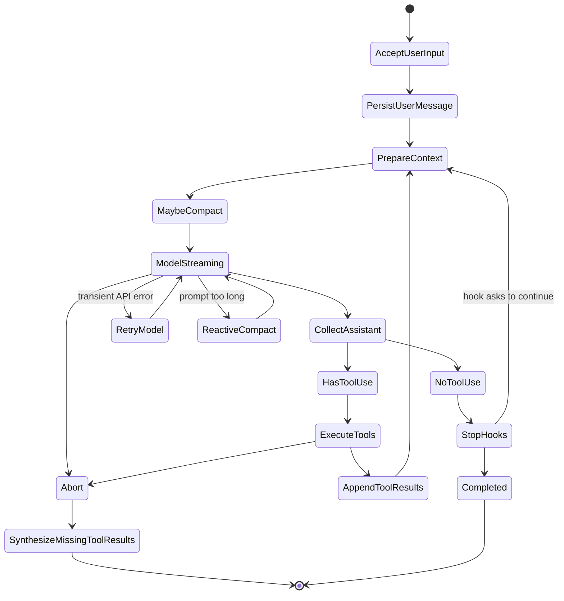

# 2. Core Runtime Model

## 2.1 Message Types

Use a normalized internal message model. Do not store raw provider messages everywhere.

Recommended message union:

```ts
type Message =
  | UserMessage
  | AssistantMessage
  | ToolResultMessage
  | SystemMessage
  | ProgressMessage
  | AttachmentMessage
  | TombstoneMessage
```

Required fields:

| Field | Purpose |
|---|---|
| `uuid` | Local stable message ID |
| `type` | Message kind |
| `createdAt` | Ordering and persistence |
| `parentUuid?` | Transcript continuity |
| `source?` | user, tool, system, agent, hook |
| `isMeta?` | Hidden/control message not authored by user |
| `toolUseResult?` | Human-readable tool result summary |

Assistant messages must preserve model tool-use blocks exactly enough to replay them. Tool result messages must preserve `tool_use_id` so provider APIs can validate pairing.

## 2.2 Main Agent Loop

The core loop should be an async generator so UI, SDK, and task systems can stream events.

```ts
async function* query(params: QueryParams): AsyncGenerator<QueryEvent, Terminal> {
  let state = createInitialLoopState(params)

  while (true) {
    const messagesForQuery = await prepareContext(state)

    yield { type: "stream_request_start" }

    const assistantMessages = []
    const toolUseBlocks = []

    for await (const event of callModelStream(messagesForQuery, state)) {
      yield event

      if (event.type === "assistant") {
        assistantMessages.push(event)
        toolUseBlocks.push(...extractToolUses(event))
      }
    }

    if (state.abortController.signal.aborted) {
      yield* synthesizeMissingToolResults(assistantMessages)
      return { reason: "aborted" }
    }

    if (toolUseBlocks.length === 0) {
      const stop = await runStopHooks(state, assistantMessages)
      if (stop.shouldContinue) {
        state = appendMetaUserMessage(state, stop.message)
        continue
      }
      return { reason: "completed" }
    }

    const toolResults = []
    for await (const update of runTools(toolUseBlocks, state.toolContext)) {
      yield update
      toolResults.push(update)
    }

    state = {
      ...state,
      messages: [
        ...messagesForQuery,
        ...assistantMessages,
        ...toolResults,
      ],
      turnCount: state.turnCount + 1,
    }

    if (state.maxTurns && state.turnCount > state.maxTurns) {
      return { reason: "max_turns" }
    }
  }
}
```

Core invariant:

Every assistant `tool_use` sent back to the API must have a matching user `tool_result`. If execution aborts, synthesize error tool results instead of dropping the pair.

## 2.3 Loop State Machine

Implement the loop as a state machine even if the code is written as an async generator. This makes failure recovery testable.



Required terminal reasons:

| Reason | Trigger | Required Cleanup |
|---|---|---|
| `completed` | Assistant returns no tool calls and stop hooks do not continue | Persist final assistant message |
| `aborted` | User interrupt, parent abort, timeout | Generate missing `tool_result` errors; stop child tasks when owned |
| `max_turns` | `turnCount > maxTurns` | Persist max-turn system/error message |
| `prompt_too_long` | Reactive compact failed or disabled | Persist blocking error and suggest compact/clear |
| `max_output_tokens` | Recovery attempts exhausted | Persist partial assistant content and recovery error |
| `tool_error` | Non-recoverable tool execution failure | Return tool result error, do not break transcript pairing |

## 2.4 Failure Handling Rules

These rules should be unit-tested:

| Failure | Correct Behavior |
|---|---|
| Model stream disconnects before any assistant content | Retry according to provider retry policy; do not append partial assistant |
| Model stream disconnects after a complete `tool_use` | Either discard incomplete assistant on retry or synthesize tool errors if already committed |
| Tool throws exception | Convert to `tool_result` error with the original `tool_use_id` |
| Tool permission denied | Return a tool result explaining denial; let model choose a different path |
| User aborts during tool execution | Cancel tools with `interruptBehavior() === "cancel"`; wait/block for tools with `"block"` |
| Context exceeds limit before model call | Full compact once; if compact fails 3 consecutive times, block |
| Provider rejects prompt as too long | Reactive compact and retry once; after that fail explicitly |
| Provider returns max-output error | Add a recovery user message, escalate output tokens up to `64_000`, stop after 3 recovery turns |

## 2.5 Transcript Pairing Validator

Before every provider API call, run a validator over the normalized messages:

```ts
function validateToolPairs(messages: Message[]): ValidationError[] {
  const open = new Map<string, { assistantUuid: string; toolName: string }>()

  for (const message of messages) {
    if (message.type === "assistant") {
      for (const block of message.content) {
        if (block.type === "tool_use") {
          open.set(block.id, {
            assistantUuid: message.uuid,
            toolName: block.name,
          })
        }
      }
    }

    if (message.type === "tool_result") {
      open.delete(message.toolUseId)
    }
  }

  return [...open].map(([toolUseId, meta]) => ({
    type: "missing_tool_result",
    toolUseId,
    ...meta,
  }))
}
```

Repair policy:

1. If the missing result belongs to the current aborted turn, synthesize an error result.
2. If it belongs to a previous persisted turn, insert a repair message before the next model call.
3. If a `tool_result` has no preceding `tool_use`, tombstone or omit it from provider context, but keep it in local transcript for audit.
